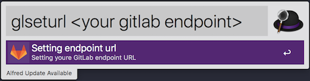
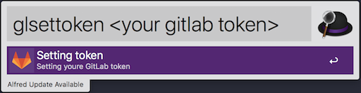
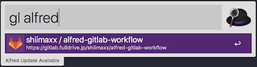
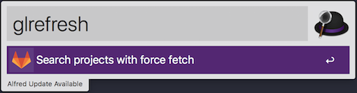

# alfred-gitlab-workflow

alfred-gitlab-workflow is workflow written in Golang.
This workflow will support search of your gitlab repositories.

## Usage

- Download from `https://github.com/shiimaxx/alfred-gitlab-workflow/releases`
- Get GitLab personal access token from `https://<your gitlab endpjoint>/profile/personal_access_tokens`
- Set GitLab API endpint
    - example: `https://gitlab.example.com/api/v4/`

    

- Set Gialab personal access token

    

- Search repositories
    - `gl` searches repositories from GitLab API. Using cache and doesn't request GitLab API when cache file is exists

    

    - `glrefresh` searches repositories from GitLab API (not using cache). Overwrite cache file when cache file is exists.

    

## License

[MIT](https://github.com/shiimaxx/alfred-gitlab-workflow/blob/master/LICENSE)

## Author

[shiimaxx](https://github.com/shiimaxx)
